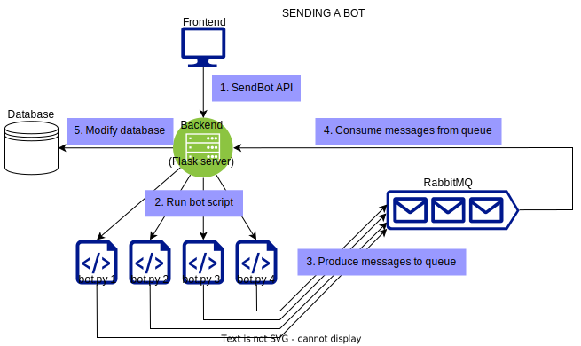

# Current Architecture



# Software Prerequisites

1. **Install [RabbitMQ](https://www.rabbitmq.com/docs/download)**
   - **Suggested way:**
     1. (If haven't already done so) Install [Docker Desktop](https://www.docker.com/products/docker-desktop/)
     2. Run the following docker command:
        ```sh
        docker run -it --rm --name rabbitmq -p 5672:5672 -p 15672:15672 rabbitmq:3.13-management
        ```

# Starting the Backend Server

1. **Navigate to the backend directory:**

   ```sh
   cd backend
   ```

2. **(Optional, but highly recommended) Activate the virtual environment:**

   - **If on Windows:**
     1. Create the virtual environment (if not already created):
        ```sh
        python -m venv venv
        ```
     2. Activate the virtual environment:
        ```sh
        .\venv\Scripts\activate
        ```
   - **If on Linux:**
     1. Create the virtual environment (if not already created):
        ```sh
        python3 -m venv venv
        ```
     2. Activate the virtual environment:
        ```sh
        source venv/bin/activate
        ```

3. **Install the required packages:**

   ```sh
   pip install -r requirements.txt
   ```

4. **Set the Flask application environment variable:**

   - **If on Windows:**
     - Using Command Prompt:
       ```sh
       set FLASK_APP=__init__.py
       ```
     - Using PowerShell:
       ```sh
       $env:FLASK_APP="__init__.py"
       ```
   - **If on Linux:**
     ```sh
     export FLASK_APP=__init__.py
     ```

5. **Run the Flask application:**
   ```sh
   flask run
   ```

## Resetting the Database

To reset the mock database to original form, do **STEP 1 & 4** from **Starting the Backend Server** section, then open a Flask shell using the following command:

```sh
flask shell
```

then run

```sh
from backend.insert_data import *
```

You should see "Data inserted successfully" printed in your terminal.

# Starting the Frontend

1. **Navigate to the frontend directory:**
   ```sh
   cd frontend
   ```
2. **Install Node.js**
3. **Install the required packages:**
   ```sh
   npm install
   ```
4. **Start the React application**
   ```sh
   npm start
   ```

**Note: You may need to move the node_modules folder to inside the frontend directory. The root folder should only contain 2 folders, titled 'backend' and 'frontend'.**

# Read Frontend Code Documentation

1. **Navigate to the frontend directory:**
   ```sh
   cd frontend
   ```
2. **(If haven't already done so) Install JSDoc globally using npm**
   ```sh
   npm install -g jsdoc
   ```
3. **Generate JSDoc**
   ```sh
   jsdoc -c jsdoc.json
   ```
4. **Navigate to the newly created docs/ folder and open index.html**
